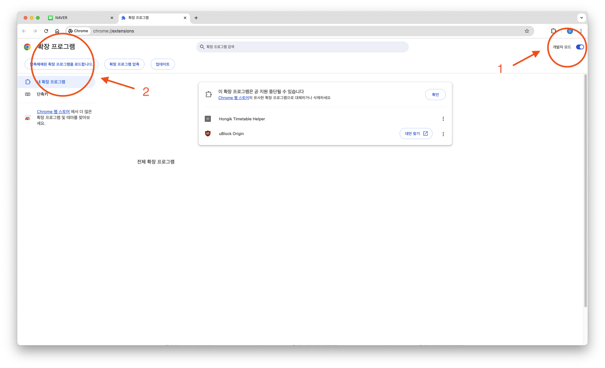
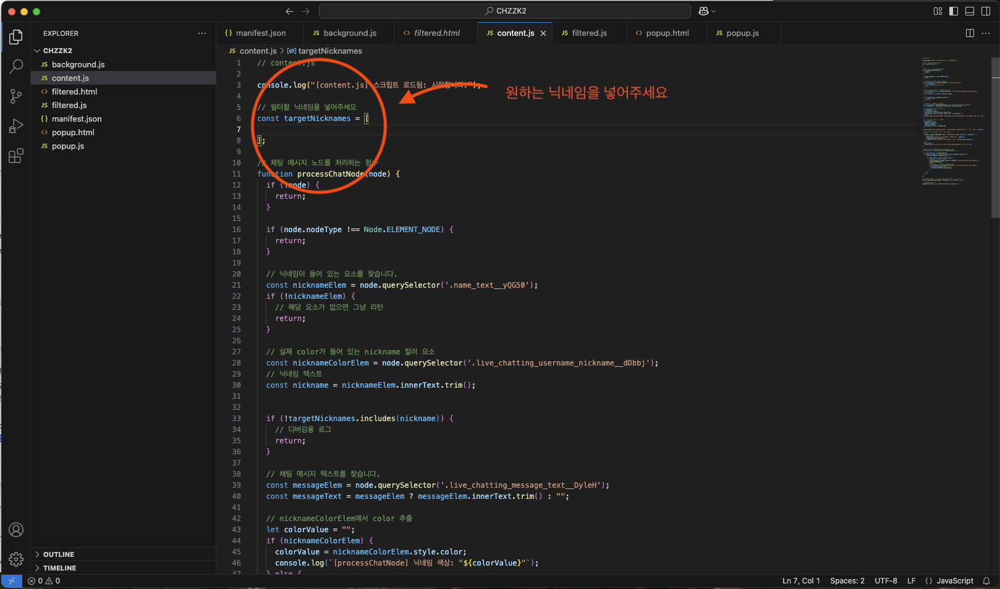

# CHZZKTracker - 치지직 닉네임 필터 크롬 확장 프로그램

네이버 치지직 스트리밍 채팅 중에서 특정 닉네임의 채팅만 따로 추적·표시해 주는 크롬 확장 프로그램입니다.

> **실사용**  
> 사진 추가 예정

---

## 설치 방법

1. 다운로드 후 크롬 브라우저 주소창에 `chrome://extensions`를 입력해 접속합니다. 
2. 화면 우측 상단의 개발자 모드를 켭니다.
3. 압축해제된 확장 프로그램을 로드 버튼을 클릭한 뒤, 방금 다운로드한 폴더를 선택합니다.

---

## 사용 방법

1. **필터할 닉네임 설정**  
   - 프로젝트 폴더 안에 있는 `content.js`(코드 파일)를 열어, 추적할 닉네임들을 설정합니다.
   - 
2. **치지직 페이지 접속**  
   - 치지직(네이버 스트리밍 사이트)에 접속 후, 채팅창이 보이는 상태를 유지합니다.
3. **확장 프로그램 팝업 열기**  
   - 크롬 툴바 오른쪽 상단(퍼즐 모양 아이콘)에 새로 설치된 확장 프로그램 아이콘이 보이면, 이를 클릭하여 팝업을 엽니다.
4. **필터링된 채팅창 열기**  
   - 팝업 안의 버튼(“채팅 걸러내기”)을 누르면 별도의 팝업 창이 열리며, 설정한 닉네임의 채팅만 실시간으로 표시됩니다.

---

## 주요 기능

- **특정 닉네임 필터**  
  설정한 닉네임만을 실시간으로 모니터링 한 후 그 닉네임의 채팅 메시지를 별도의 창에 표시합니다.

- **실시간 업데이트**  
  MutationObserver를 통해 새로운 채팅이 올라올 때마다 필터링을 자동 처리합니다.

- **팝업 창**  
  크롬 확장 프로그램 팝업을 통해 버튼을 누르면 별도의 작은 창에서 필터된 채팅을 확인할 수 있습니다.

---

## 작동 원리

1. **채팅 데이터 추출 (`content.js`)**  
   - 치지직 사이트의 채팅 영역을 관찰(MutationObserver)합니다.  
   - 들어온 채팅에서 원하는 닉네임과 일치하는 메시지만 추출합니다.  
   - 추출된 채팅 데이터를 백그라운드 스크립트로 전달합니다.

2. **백그라운드 스크립트 (`background.js`)**  
   - `content.js`로부터 전달된 채팅 데이터를 받아 보관합니다.  
   - 필터된 채팅 정보를 수신할 페이지(`filtered.html`)가 연결되면, 해당 페이지에 메시지를 중계해 줍니다.  
   - 확장 프로그램이 종료되지 않도록 주기적으로 깨어나는 알람 설정 등 부가적인 관리 로직이 들어 있습니다.

3. **필터링된 채팅 페이지 (`filtered.html` + `filtered.js`)**  
   - 백그라운드 스크립트와 연결(Port 통신)을 맺어, 필터링된 채팅 메시지를 실시간으로 전달받습니다.  
   - 전달받은 채팅 메시지를 화면에 표시하고, 새 메시지가 오면 자동으로 스크롤을 내려 줍니다.

4. **크롬 확장 프로그램 설정 (`manifest.json`)**  
   - 크롬 확장 프로그램의 버전, 권한, 동작 환경 등을 정의합니다.  
   - 특정 도메인(예: 치지직 사이트)에 대해 어떤 스크립트를 삽입할지, 어떤 파일이 백그라운드 스크립트인지 등을 선언합니다.

5. **팝업 페이지 (`popup.html` + `popup.js`)**  
   - 확장 프로그램 아이콘을 클릭했을 때 열리는 작은 팝업 화면입니다.  
   - 여기서 “채팅 걸러내기” 버튼을 누르면, `filtered.html`을 새로운 팝업 창으로 띄워 필터링된 채팅 내역을 확인할 수 있게 합니다.

---

## 각 파일 설명

- **`content.js`**  
  치지직 페이지에서 채팅 메시지 DOM을 관찰하고, 특정 닉네임의 메시지만 골라 백그라운드 스크립트에 전달합니다.
  
- **`background.js`**  
  확장 프로그램의 중심에서 메시지를 중계하고, 유휴 상태 방지(알람) 등의 작업을 수행합니다.

- **`filtered.html` / `filtered.js`**  
  필터링된 채팅만 보여 주는 전용 페이지입니다. 백그라운드 스크립트와 연결하여, 전송받은 메시지를 화면에 표시합니다.

- **`popup.html` / `popup.js`**  
  크롬 확장 프로그램 아이콘을 클릭했을 때 열리는 팝업 인터페이스를 구성합니다. 여기서 “채팅 걸러내기” 버튼으로 `filtered.html` 창을 띄울 수 있습니다.

- **`manifest.json`**  
  확장 프로그램의 설정(권한, 버전, 실행 스크립트 등)을 선언하는 파일입니다.

