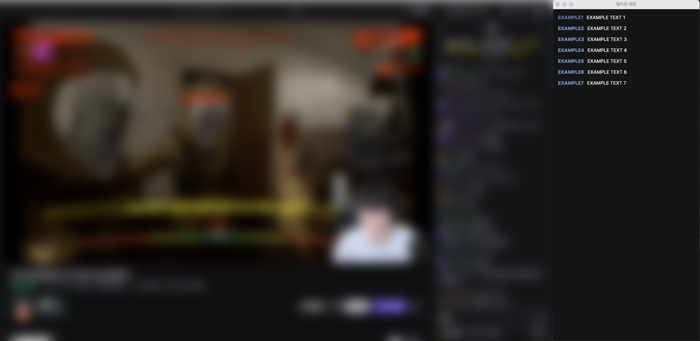

# CHZZKTracker - 치지직 닉네임 필터 크롬 확장 프로그램

네이버 치지직 스트리밍 채팅 중 특정 닉네임의 채팅만 따로 추적·표시해 주는 크롬 확장 프로그램입니다.

   

> **실사용**  
> 

---

## 설치 방법

1. 다운로드 후 크롬 브라우저 주소창에 `chrome://extensions`를 입력해 접속합니다. 
2. 화면 우측 상단의 개발자 모드를 켭니다.
3. 압축해제된 확장 프로그램 로드 버튼을 클릭한 뒤, 방금 다운로드한 폴더를 선택합니다.

---

## 사용 방법

1. **필터할 닉네임 설정**  
   - 프로젝트 폴더 안에 있는 `content.js`(코드 파일)를 열어, 추적할 닉네임들을 설정합니다.
   - 
2. **치지직 페이지 접속**  
   - 치지직(네이버 스트리밍 사이트)에 접속 후, 채팅창이 보이는 상태를 유지합니다.
3. **확장 프로그램 팝업 열기**  
   - 크롬 툴바 오른쪽 상단(퍼즐 모양 아이콘)에 새로 설치된 확장 프로그램 아이콘이 보이면, 이를 클릭하여 팝업을 엽니다.
4. **필터링된 채팅창 열기**  
   - 팝업 안의 버튼(“채팅 걸러내기”)을 누르면 별도의 팝업 창이 열리며, 설정한 닉네임의 채팅만 실시간으로 표시됩니다.

---

## 주요 기능

- **특정 닉네임 필터**  
  설정한 닉네임만을 실시간으로 모니터링 한 후 그 닉네임의 채팅 메시지를 팝업 창에 표시합니다.

- **채팅 실시간 업데이트**  
  MutationObserver를 통해 새로운 채팅이 올라올 때마다 필터링을 자동 처리합니다.

- **프로그램 꺼짐 방지**  
  알림 기능을 이용해 프로그램을 1분마다 깨웁니다.

---

## 작동 방식

1. **채팅 데이터 추출 (`content.js`)**  
   - 치지직 사이트의 채팅 영역을 관찰(MutationObserver)합니다.  
   - 들어온 채팅에서 원하는 닉네임과 일치하는 메시지만 추출합니다.  
   - 추출된 채팅 데이터를 백그라운드 스크립트로 전달합니다.

2. **백그라운드 스크립트 (`background.js`)**  
   - `content.js`로부터 전달된 채팅 데이터를 받아 보관합니다.  
   - 필터된 채팅 정보를 수신할 페이지(`filtered.html`)가 연결되면, 해당 페이지에 메시지를 보여 줍니다.  
   - 확장 프로그램이 종료되지 않도록 주기적으로 깨어나는 알람 설정도 추가했습니다.

3. **필터링된 채팅 페이지 (`filtered.html` + `filtered.js`)**  
   - 백그라운드 스크립트와 Port 통신을 맺어, 필터링된 채팅 메시지를 실시간으로 전달받습니다.  
   - 전달받은 채팅 메시지를 화면에 표시하고, 새 메시지가 오면 자동으로 스크롤합니다.

4. **크롬 확장 프로그램 설정 (`manifest.json`)**  
   - 크롬 확장 프로그램의 버전, 권한, 동작 환경 등을 정의합니다.  
   - 치지직 사이트에서 어떤 스크립트를 삽입할지, 어떤 파일이 백그라운드 스크립트인지 등을 선언합니다.

5. **팝업 페이지 (`popup.html` + `popup.js`)**  
   - 확장 프로그램 아이콘을 클릭했을 때 열리는 팝업 창입니다.  
   - 여기서 “채팅 걸러내기” 버튼을 누르면, `filtered.html`을 새로운 팝업 창으로 띄워 필터링된 채팅 내역을 확인할 수 있게 합니다.

---
해당 프로그램은 네이버 naver.com과 치지직 chzzk.naver.com과 아무 연관이 없습니다. 
